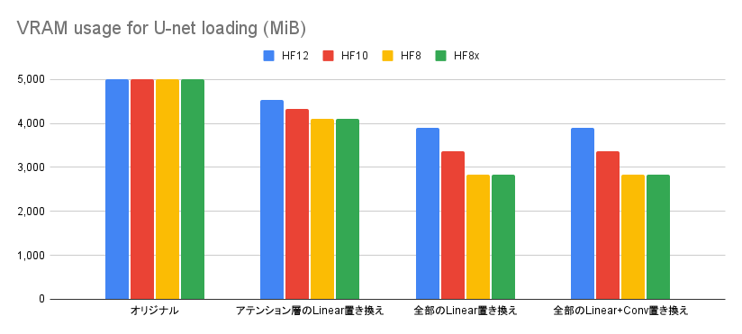
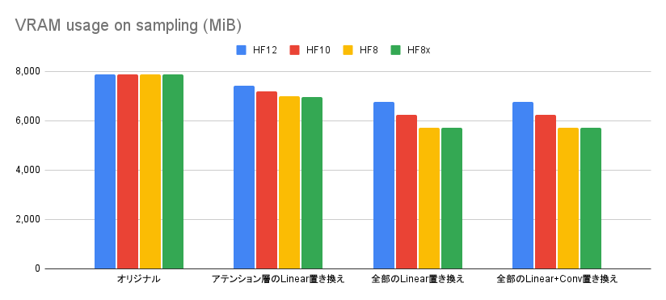

# nfpn

[→日本語はここ](./README_ja.md)

This library reduces VRAM consumption in applications such as stable diffusion, by reducing the bit depth of the model weight in memory.

The name `nfpn` stands for `Narrowed floating point number`.

Currently, `HF12` with 12 bits, `HF10` with 10 bits, and `HF8` / `HF8x` with 8 bits are implemented.

The following effects are available in SDXL:
- Up to 27% less VRAM usage during generation
- Generation time is increased by 4-11% (e.g. 30s becomes 31-33s)

## Comparison of VRAM usage and generation speed

FP16, HF12, HF10, HF8 and HF8x comparison.

The measurement code can be found in [examples/minimum.py](./examples/minimum.py).

```
[Conditions]
Model: Animagine XL 3.0 (fp16)
Scheduler: Euler a
Prompt: 1girl, cute princess, frilled white dress, long sleeves highneck dress, elaborated lace, brown hair, sitting, tiara, red eyes, eyelashes, twinkle eyes, smile, flower garden, cinematic lighting, necklace, masterpiece, best quality
Negative prompt: nsfw, collarbone, lowres, bad anatomy, bad hands, text, error, missing fingers, extra digit, fewer digits, cropped, worst quality, low quality, normal quality, jpeg artifacts, signature, watermark, username, blurry, artist name, bad eyes
Batch size: 4
Image size: 1024x1024
Steps: 30
CFG scale: 6.0
Seed: 1
```

Three figures below show the VRAM usage during U-net loading, the VRAM usage during sampling generation, and the sampling time per step respectively.

The first figure shows the result of the original model with the weights of `FP16`. The second figure shows the result with only the attention's `Linear` replaced with HF format. The third figure shows the result with all `Linear` layers replaced with HF format. And the fourth figure shows the result with all `Linear` and `Conv2d` layers replaced with HF format.





The first figure shows the VRAM usage on model loading. The HF format reduces VRAM usage by up to 43%. The second figure shows the VRAM usage during inference, which has been reduced by up to 27%. The third figure shows the relative comparison of generation times. Compared to FP16, the generation time is 4-11% longer than for FP16. Of course, HF format will be much faster then FP16 when your model overflows from VRAM. For implementation reasons, `HF8` and `HF8x` are faster than `HF12` and `HF10`.

## Examples of generated images

```
[Conditions]
Model: Animagine XL 3.0 (fp16)
Scheduler: Euler a
Prompt: 1girl, cute princess, frilled white dress, long sleeves highneck dress, elaborated lace, brown hair, sitting, tiara, red eyes, eyelashes, twinkle eyes, smile, flower garden, cinematic lighting, necklace, masterpiece, best quality
Negative prompt: nsfw, collarbone, lowres, bad anatomy, bad hands, text, error, missing fingers, extra digit, fewer digits, cropped, worst quality, low quality, normal quality, jpeg artifacts, signature, watermark, username, blurry, artist name, bad eyes
Batch size: 4
Image size: 1024x1024
Steps: 30
CFG scale: 6.0
Seed: 1
```

With `HF12`, there is no noticeable change. With `HF10` some compositional changes are observed. These changes are a bit more significant with `HF8` and `HF8x`.

There is no image breakdown in any of these settings.

### HF12


### HF10


### HF8


### HF8x


## How to use

For the module you want to apply HF format, call `nfpn.nn.to_hf(8|8x|10|12)` as follows. If the module is in VRAM, the conversion process will be performed on the GPU, which improves the speed of the conversion.

```python
import nfpn
# mod = nfpn.nn.to_hf8(mod)
# mod = nfpn.nn.to_hf8x(mod)
# mod = nfpn.nn.to_hf10(mod)
mod = nfpn.nn.to_hf12(mod)
```

See [examples/generate.py](./examples/generate.py) for the example with `diffusers`.

## Format details

Let `s` be the sign bit, `E` be the exponent bits, and `f` be the mantissa bits. In this case, float16 has the following format:

`s_EEEEE_ffffffffff`

First, the distribution of floating-point exponents (`EEEEE`) of Animagine's all `Linear` layers is shown below.

| EEEEE | exponents | count |
| --- | --- | --- |
| 00000 | -14 (subnormal) |    5,160,891 |
| 00001 | -14             |    5,171,614 |
| 00010 | -13             |   10,327,845 |
| 00011 | -12             |   20,646,282 |
| 00100 | -11             |   41,211,986 |
| 00101 | -10             |   81,813,038 |
| 00110 | -9              |  159,720,956 |
| 00111 | -8              |  301,214,975 |
| 01000 | -7              |  508,863,860 |
| 01001 | -6              |  643,685,247 |
| 01010 | -5              |  411,904,731 |
| 01011 | -4              |   42,789,799 |
| 01100 | -3              |      132,446 |
| 01101 | -2              |        3,805 |
| 01110 | -1              |          197 |
| 01111 |  0              |            8 |
| 10000 |  1              |            0 |
| 10001 |  2              |            0 |
| 10010 |  3              |            0 |
| 10011 |  4              |            0 |
| 10100 |  5              |            0 |
| 10101 |  6              |            0 |
| 10110 |  7              |            0 |
| 10111 |  8              |            0 |
| 11000 |  9              |            0 |
| 11001 | 10              |            0 |
| 11010 | 11              |            0 |
| 11011 | 12              |            0 |
| 11100 | 13              |            0 |
| 11101 | 14              |            0 |
| 11110 | 15              |            0 |
| 11111 | (subnormal)     |            0 |

It has a peak at -6, which clearly indicating that the distribution is biased. Based on this bias, we should be able to reduce bit depth without losing as much precision as possible in the 10 bits mantissa part (`ffffffffff`).

Specifically, I allocated 3 bits as exponent bits to represent the range -11..-5. This narrows the value range of the format, but the exponent could be reduced by 2 bits.

Adding 1 sign bit to this 3 bits exponent, we got 4 bits sequence which we can add an arbitary precision mantissa part to.

Also, since we assigned 7 numbers (-11..-5) for 3 bits, we have 1 extra state. This is used as a special (subnormal) state, which represents the numbers whose original exponent was less than -11 or greater then -5.

For an exponent less than -11, there can only be -12, -13, -14 and subnormal numbers. So we need to allocate extra 2 bits from mantissa part to represent these exponents.

If we assign the same bits for exponent greater than -5, we can express -4, -3, -2, and -1. Zero or greater numbers can be ignored because they rarely appear. If they do occur, give up converting and keep the module float16.

With this in mind, provides the following formats:nfpn

Based on the above ideas, `nfpn` provides following formats:

### HF12

the format which allocates 8 bits for mantissa part

```
hf12 type-a: sEEE_ffff_ffff  [2^(-11), 2^(-4))
hf12 type-b: s000_ffff_f0xx  [2^(-15), 2^(-11))
hf12 type-c: s000_ffff_f1yy  [2^(-4), 2^(-1))
```

### HF10

the format which allocates 6 bits for mantissa part

```
hf10 type-a: s_EEE_ffffff  [2^(-11), 2^(-4))
hf10 type-b: s_000_fff0xx  [2^(-15), 2^(-11))
hf10 type-c: s_000_fff1yy  [2^(-4), 2^(-1))
```

### HF8

the format which allocates 4 bits for mantissa part

NB. this format has only single bit precision for subnormal numbers

```
hf8 type-a: s_EEE_ffff  [2^(-11), 2^(-4))
hf8 type-b: s_000_f0xx  [2^(-15), 2^(-11))
hf8 type-c: s_000_f1yy  [2^(-4), 2^(-1))
```

### HF8x

Unlike the above formats, this is the format in which 4 bits are assigned to the exponent part and 3 bits are assigned to the mantissa part.

The format is the same as FP8 (E4M3), but the exponential bias is different.

```
hf8x: s_EEE_Efff  [2^(-15), 2^1)
```
