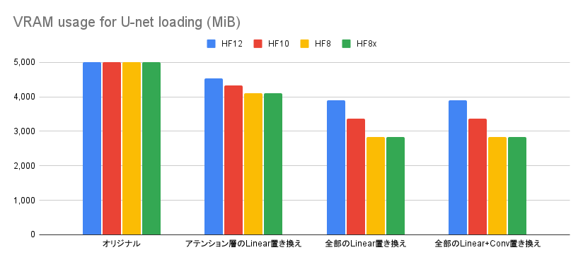
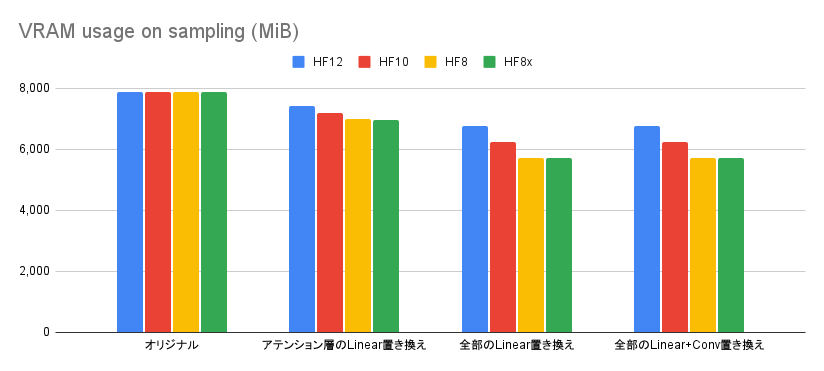
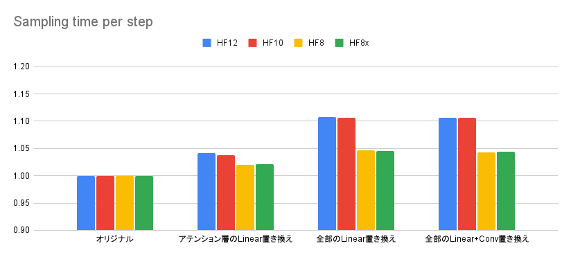

# nfpn

Stable diffusion などのアプリケーションにおいて、メモリ中に保持されたモデルのビット数を減らすことで VRAM 消費量を削減するライブラリです。

名前の `nfpn` は `Narrowed floating point number` の略です。

今のところ、12ビットの `HF12`、10ビットの `HF10`、8ビットの `HF8` / `HF8x` が使えます。

SDXLにおいて以下の効果があります。

- 生成時のVRAM使用量が最大で27%減少します
- 生成時間が4-11%長くなります（30sが31-33sになる程度）

## VRAM消費量と生成速度の比較

FP16、HF12、HF10、HF8、HF8xの比較です。

測定用コードは [examples/minimum.py](./examples/minimum.py) にあります。

```
[生成条件]
モデル: Animagine XL 3.0 (fp16)
スケジューラ: Euler a
プロンプト: 1girl, cute princess, frilled white dress, long sleeves highneck dress, elaborated lace, brown hair, sitting, tiara, red eyes, eyelashes, twinkle eyes, smile, flower garden, cinematic lighting, necklace, masterpiece, best quality
ネガティブプロンプト: nsfw, collarbone, lowres, bad anatomy, bad hands, text, error, missing fingers, extra digit, fewer digits, cropped, worst quality, low quality, normal quality, jpeg artifacts, signature, watermark, username, blurry, artist name, bad eyes
バッチサイズ: 4
生成サイズ: 1024x1024
ステップ数: 30
CFGスケール: 6.0
seed: 1
```

以下のグラフは、U-netのロード時のVRAM消費量、サンプリング（生成）時のVRAM消費量、ステップあたりのサンプリング時間を測定したものです。

一番左はオリジナルの U-netで、`FP16` のときの結果です。二番目はアテンション層の `Linear` のみHF形式に置き換えたものです。三番目はすべての `Linear` を HF形式で置き換えたもの、四番目はすべての `Linear` と `Conv2d` をHF形式で置き換えたものです。





最初の図がモデルをロードしたときのVRAM消費量です。HF形式にすることで、VRAM消費量が最大で43%削減されています。
二番目の図が推論中のVRAM消費量で、最大で27%減っています。
三番目の図が生成時間の相対比較です。FP16に比べて、生成時間が4-11%長くなります。もちろんFP16でVRAMからあふれる場合にはHF形式の方がずっと速くなります。実装の都合上、`HF12` / `HF10` よりも `HF8` / `HF8x` の方が高速です。

## 生成画像の例

```
[生成条件]
モデル: Animagine XL 3.0 (fp16)
スケジューラ: Euler a
プロンプト: 1girl, cute princess, frilled white dress, long sleeves highneck dress, elaborated lace, brown hair, sitting, tiara, red eyes, eyelashes, twinkle eyes, smile, flower garden, cinematic lighting, necklace, masterpiece, best quality
ネガティブプロンプト: nsfw, collarbone, lowres, bad anatomy, bad hands, text, error, missing fingers, extra digit, fewer digits, cropped, worst quality, low quality, normal quality, jpeg artifacts, signature, watermark, username, blurry, artist name, bad eyes
バッチサイズ: 4
生成サイズ: 1024x1024
ステップ数: 30
CFGスケール: 6.0
seed: 1
```

`HF12`では、目立った変化は見られません。`HF10`では一部の構図が変化しています。`HF8`と`HF8x`では構図の変化がもう少し大きくなります。

いずれの設定でも、画像の破綻は見られません。

### HF12


### HF10


### HF8


### HF8x


## 使い方

適用したいモジュール `mod` に対して以下のように `nfpn.nn.to_hf(8|8x|10|12)` を呼び出します。モジュールがすでにVRAM上に存在していると、変換処理がGPUで行われるため変換の速度が改善します。

```python
import nfpn
# mod = nfpn.nn.to_hf8(mod)
# mod = nfpn.nn.to_hf8x(mod)
# mod = nfpn.nn.to_hf10(mod)
mod = nfpn.nn.to_hf12(mod)
```

`diffusers` での例は [examples/generate.py](./examples/generate.py) にあります。

## フォーマット詳細

以下、`s` を符号ビット、`E` を指数部のビット、`f` を仮数部のビットとします。
このとき、float16 は以下の形式となります。

`fp16: s_EEEEE_ffffffffff`

まず、Animagine XL 3.0 を float16 化したときの、全 Linear 層における浮動小数点の指数部 (`EEE`) の分布を以下に示します。

| EEEEE | 指数 | 個数 |
| --- | --- | --- |
| 00000 | -14 (subnormal) |    5,160,891 |
| 00001 | -14             |    5,171,614 |
| 00010 | -13             |   10,327,845 |
| 00011 | -12             |   20,646,282 |
| 00100 | -11             |   41,211,986 |
| 00101 | -10             |   81,813,038 |
| 00110 | -9              |  159,720,956 |
| 00111 | -8              |  301,214,975 |
| 01000 | -7              |  508,863,860 |
| 01001 | -6              |  643,685,247 |
| 01010 | -5              |  411,904,731 |
| 01011 | -4              |   42,789,799 |
| 01100 | -3              |      132,446 |
| 01101 | -2              |        3,805 |
| 01110 | -1              |          197 |
| 01111 |  0              |            8 |
| 10000 |  1              |            0 |
| 10001 |  2              |            0 |
| 10010 |  3              |            0 |
| 10011 |  4              |            0 |
| 10100 |  5              |            0 |
| 10101 |  6              |            0 |
| 10110 |  7              |            0 |
| 10111 |  8              |            0 |
| 11000 |  9              |            0 |
| 11001 | 10              |            0 |
| 11010 | 11              |            0 |
| 11011 | 12              |            0 |
| 11100 | 13              |            0 |
| 11101 | 14              |            0 |
| 11110 | 15              |            0 |
| 11111 | (subnormal)     |            0 |

-6 にピークを持っており、明らかに値が偏っていることが分かります。この偏りをもとにビットの割り当てをうまく工夫すれば、10ビットあった仮数部 (`ffffffffff`) の精度をできるだけ落とさずに、ビット数を減らすことができるはずです。

具体的には、指数 -11..-5 の範囲に指数ビットを3ビット割り当てます。表現できる範囲は狭まりましたが、指数を2ビット減らすことができました。

符号1ビットを加えて4ビットで、ここに任意の精度の仮数部を付け加えてやります。

また、3ビットに対して7個の数字を割り当てたので、状態が1個分余っています。これを特殊な状態 (subnormal) として、もともと指数部が-12以下、もしくは-4以上だった数を詰め込みます。

指数-12以下に対しては、そもそも float16 の指数が -14 までしかないので -12、-13、-14 と非正規化数しかありえません。ちょうど4種類なので、次の-4以上の指数と識別するための1ビットを加えて3ビットを仮数部から割り当てます。

指数-4以上に対しても同じビット数を割り当ててやると、-4、-3、-2、-1 を表現できます。0 以上はまれにしか現れないので無視してやります。もし出現したら処理を諦めて、そのモジュールは float16 で保持するようにします。

以上の考えから、`nfpn` では以下のフォーマットを提供しています。

### HF12

仮数部に8ビットを割り当てたフォーマットです。

```
hf12 type-a: sEEE_ffff_ffff  [2^(-11), 2^(-4))
hf12 type-b: s000_ffff_f0xx  [2^(-15), 2^(-11))
hf12 type-c: s000_ffff_f1yy  [2^(-4), 2^(-1))
```

### HF10

仮数部に6ビットを割り当てたフォーマットです。

```
hf10 type-a: s_EEE_ffffff  [2^(-11), 2^(-4))
hf10 type-b: s_000_fff0xx  [2^(-15), 2^(-11))
hf10 type-c: s_000_fff1yy  [2^(-4), 2^(-1))
```

### HF8

仮数部に4ビットを割り当てたフォーマットです。
subnormal な数の精度が1ビットしかないので注意してください。

```
hf8 type-a: s_EEE_ffff  [2^(-11), 2^(-4))
hf8 type-b: s_000_f0xx  [2^(-15), 2^(-11))
hf8 type-c: s_000_f1yy  [2^(-4), 2^(-1))
```

### HF8x

以上のフォーマットとは異なり、指数部に4ビット、仮数部に3ビットを割り当てたフォーマットです。

形式としてはFP8 (E4M3) と同じですが、指数部バイアスが異なります。

```
hf8x: s_EEE_Efff  [2^(-15), 2^1)
```
