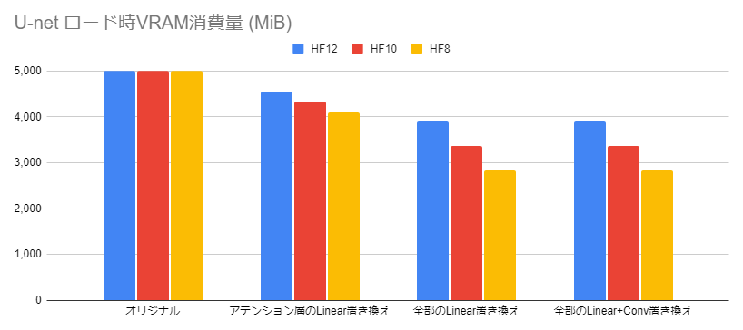
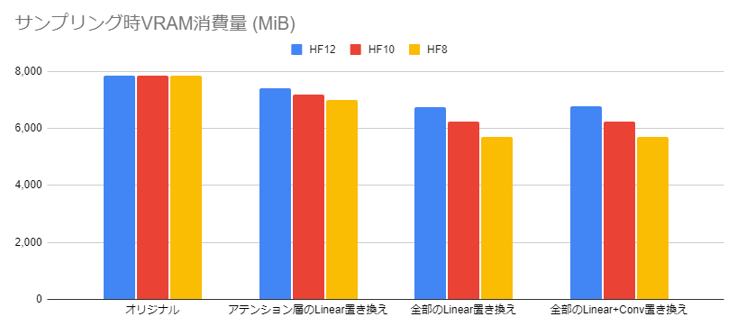
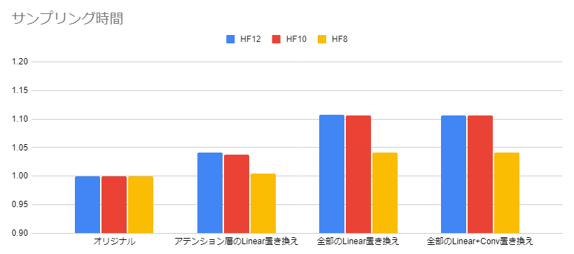

# nfpn

[→日本語解説](./README.md)

Stable diffusion シリーズにおいて、メモリ中に保持されたモデルのビット数を減らすことで VRAM 消費量を削減するライブラリです。

名前の `nfpn` は `Narrowed floating point number` の略です。

今のところ、12ビットの `HF12`、10ビットの `HF10`、8ビットの `HF8` が使えます。

## VRAM消費量と生成速度

FP16、HF12、HF10、HF8の比較です。

測定用コードは [minimum.py](./examples/minimum.py) にあります。

```
[生成条件]
モデル: Animagine XL 3.0 (fp16)
スケジューラ: Euler a
プロンプト: 1girl, cute princess, frilled white dress, long sleeves highneck dress, elaborated lace, brown hair, sitting, tiara, red eyes, eyelashes, twinkle eyes, smile, flower garden, cinematic lighting, necklace, masterpiece, best quality
ネガティブプロンプト: nsfw, collarbone, lowres, bad anatomy, bad hands, text, error, missing fingers, extra digit, fewer digits, cropped, worst quality, low quality, normal quality, jpeg artifacts, signature, watermark, username, blurry, artist name, bad eyes
バッチサイズ: 4
生成サイズ: 1024x1024
ステップ数: 30
CFGスケール: 6.0
seed: 1
```

以下、左から、オリジナルの U-net、アテンション層の `Linear` のみHF形式に置き換えたもの、すべての `Linear` を置き換えたもの、すべての `Linear` と `Conv2d` を置き換えたものの順で記載する。





モデルをロードしたときのVRAM消費量が、最大で43%削減されています。また、推論中のVRAM消費量が、最大で27%減ります。
そのかわり、重みがVRAMにすべて乗ったときに比べて生成時間が4～11%長くなります。


## 生成画像の例

### HF12


### HF10


### HF8


## 使い方

適用したいモジュール `mod` に対して以下のように `nfpn.nn.to_hf(8|10|12)` を呼び出します。モジュールがすでにVRAM上に存在していると、変換処理がGPUで行われるため速度が改善します。

```python
import nfpn
mod = nfpn.nn.to_hf12(mod)
```

## フォーマット詳細

以下、`s` を符号ビット、`E` を指数部のビット、`f` を仮数部のビットとする。

### HF12

```
hf12 type-a: sEEE_ffff_ffff  [2^(-11), 2^(-4))
hf12 type-b: s000_ffff_f0xx  [2^(-15), 2^(-11))
hf12 type-c: s000_ffff_f1yy  [2^(-4), 2^(-1))
```

### HF10

```
hf10 type-a: s_EEE_ffffff  [2^(-11), 2^(-4))
hf10 type-b: s_000_fff0xx  [2^(-15), 2^(-11))
hf10 type-c: s_000_fff1yy  [2^(-4), 2^(-1))
```

### HF8

```
hf8 type-a: s_EEE_ffff  [2^(-11), 2^(-4))
hf8 type-b: s_000_f0xx  [2^(-15), 2^(-11))
hf8 type-c: s_000_f1yy  [2^(-4), 2^(-1))
```

